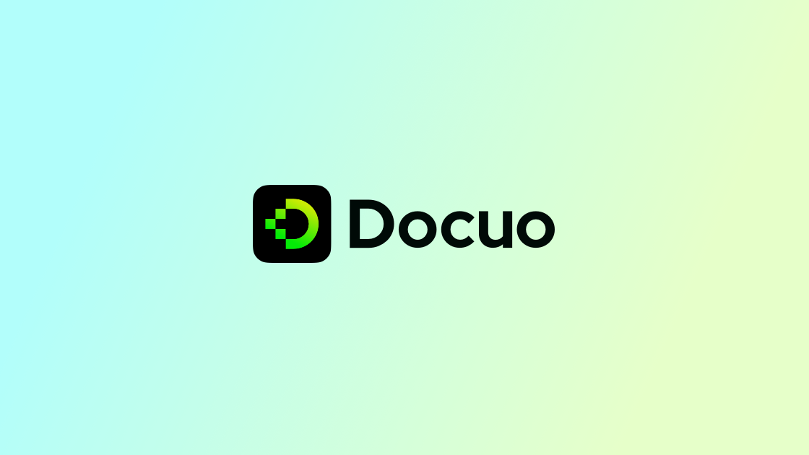
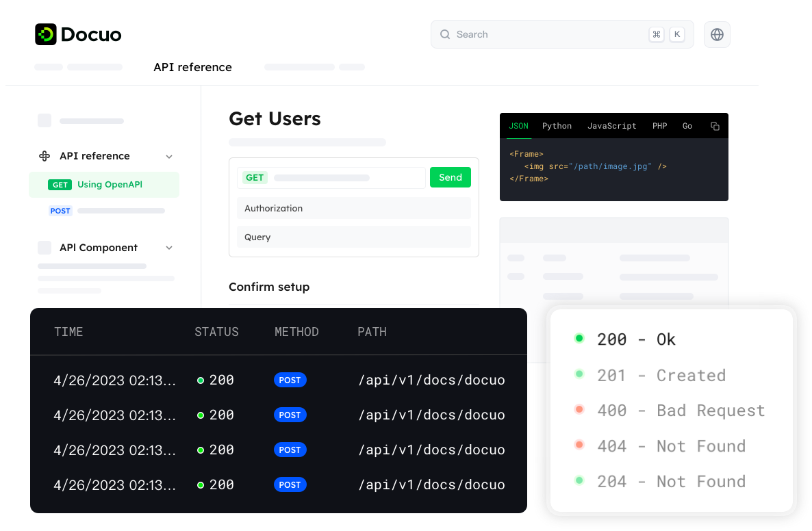
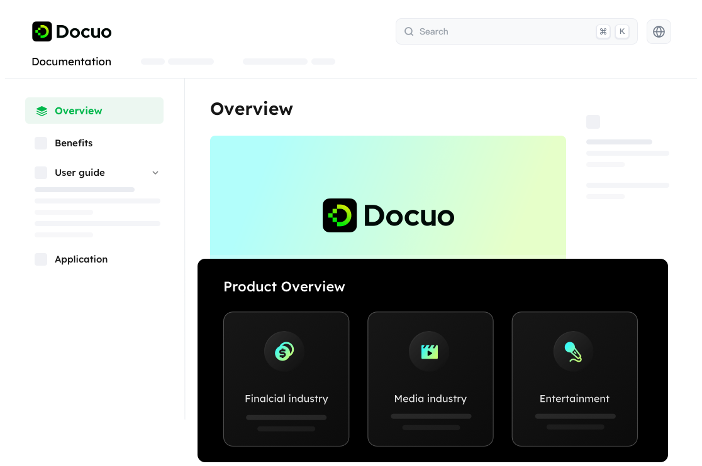

# Introduction

## You can use Docuo platform to `effortlessly` transforms

You **can** *use* ~~Docuo~~ <u>platform</u> to `effortlessly` transforms

You can use Docuo platform You can use Docuo platform [You can use Docuo platform](https://www.google.com)

```js
You can use Docuo platform to `effortlessly` transforms
```

- You can use Docuo platform to `effortlessly` transforms
- You can use Docuo platform to `effortlessly` transforms
- You can use Docuo platform to `effortlessly` transforms
    - You can use Docuo platform to `effortlessly` transforms
    - You can use Docuo platform to `effortlessly` transforms
        - You can use Docuo platform to `effortlessly` transforms

1. You can use Docuo platform to `effortlessly` transforms
2. You can use Docuo platform to `effortlessly` transforms
3. You can use Docuo platform to `effortlessly` transforms
    1. You can use Docuo platform to `effortlessly` transforms
    2. You can use Docuo platform to `effortlessly` transforms
        1. You can use Docuo platform to `effortlessly` transforms
        2. You can use Docuo platform to `effortlessly` transforms

You can use Docuo platform to `effortlessly` transforms

---

You can use Docuo platform to `effortlessly` transforms

> You can use Docuo platform to `effortlessly` transforms your static contents into a modern developer hub, API reference, product guides, and more.

<Tip title="What zz title">You can use Docuo platform to effortlessly transforms your static contents into a modern developer hub, API reference, product guides, and more.</Tip>

<Note>You can use Docuo platform to effortlessly transforms your static contents into a modern developer hub, API reference, product guides, and more.</Note>

<Warning>You can use Docuo platform to effortlessly transforms your static contents into a modern developer hub, API reference, product guides, and more.</Warning>

<Error>You can use Docuo platform to effortlessly transforms your static contents into a modern developer hub, API reference, product guides, and more.</Error>

## Welcome

Welcome to your first documentation homepage.

Docuo is a lightweight platform that can seamlessly convert your static content into dynamic and modern developer hub, API reference, product guides, and other varieties of docs sites.

<Frame width="auto" height="auto" caption="image caption caption">
  
</Frame>

<Tip title="What you can do">You can use Docuo platform to effortlessly transforms your static contents into a modern developer hub, API reference, product guides, and more.</Tip>

## Use cases

Docuo supports helping users to quickly generate different kinds of technical websites, helping companies to engage more end users.

* Developer hub
<Frame width="auto" height="auto" >
  
</Frame>

* API reference
<Frame width="auto" height="auto" >
  
</Frame>

* Product guides
<Frame width="auto" height="auto" >
  
</Frame>